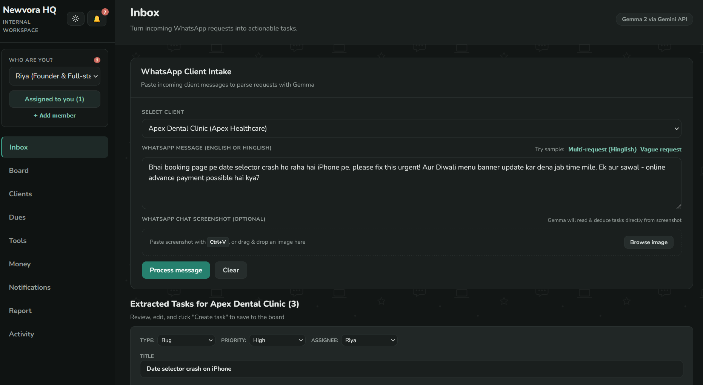
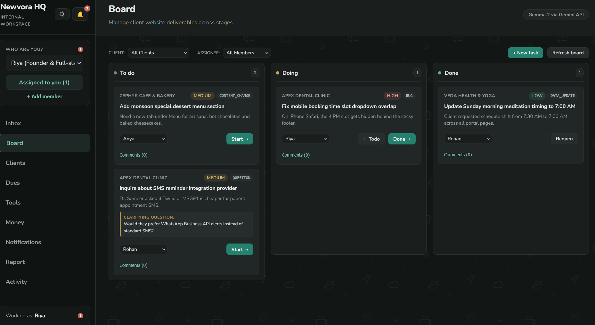
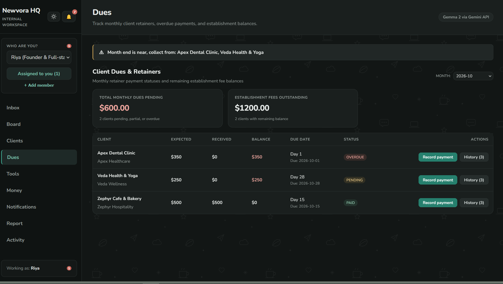
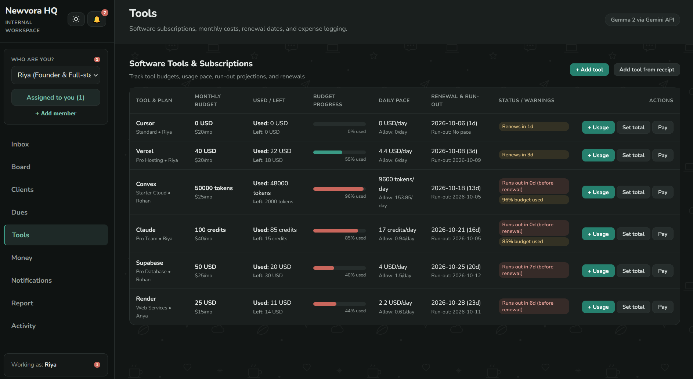

# Newvora HQ

Newvora HQ is a shared workspace for a small student-run web agency that turns WhatsApp client requests (in English or Hinglish) into organized tasks using Gemma, while keeping client payments, tool subscriptions, notifications, and monthly reports in one place. It was built for the Hacktoberfest Weekend Challenge "Build for a Friend" (October 2 to 5, 2026).

---

## Links

- **DEV post**: `https://dev.to/shalini_tiwari_/newvora-hq-a-calm-control-room-for-a-student-founder-who-keeps-her-startup-in-her-head-53i5`
- **Live demo**: [https://newvora-hq.onrender.com](https://newvora-hq.onrender.com) *(passcode is in the DEV post; first load can take about a minute on Render's free plan)*
- **Video**: [https://youtu.be/NgcwwvJbvXY](https://youtu.be/NgcwwvJbvXY)

---

## The Problem

Clients message at all hours on WhatsApp with bugs, urgent requests, and content changes, often mixing Hindi and English in informal chats. A single lead developer ends up keeping every deliverable, unpaid invoice, and renewal date locked inside her head. Teammates cannot see what needs to be done, who is working on what, or when subscription tools are running out of budget without constant manual check-ins.

---

## Screenshots


*AI Inbox: Parsing unstructured WhatsApp client messages and chat screenshots into structured deliverables with Gemma.*


*Board: Tracking deliverables across To Do, Doing, and Done columns with assignees, client filters, and task comments.*


*Dues: Monitoring monthly client retainers, overdue fees, establishment balances, and month-end collection reminders.*


*Tools: Tracking shared software subscriptions, renewal countdowns, monthly usage pace, and AI receipt extraction.*

---

## Features

Every feature listed below is fully implemented in the codebase:

- **AI Inbox (Text & Screenshot Input)**:
  - Supports pasting informal client WhatsApp messages in English or Hinglish.
  - Multimodal chat screenshot analysis via file upload, drag-and-drop, or clipboard paste.
  - Quick sample prompt buttons ("Multi-request Hinglish", "Vague request") for rapid testing.
  - One-click extraction using Gemma, breaking conversations down into structured task cards with editable title, description, request type (`bug`, `new_feature`, `data_update`, `content_change`, `question`), priority (`low`, `medium`, `high`), and polite clarifying questions.
  - Accept tasks directly onto the team Kanban Board.

- **Board with Assignees, Comments & New Task Form**:
  - Kanban board with three columns: **To Do**, **Doing**, and **Done**.
  - Filter tasks dynamically by client and by team assignee.
  - Move tasks across columns or change assignees directly on cards.
  - Dedicated "New task" modal form to manually create deliverables.
  - Comments drawer on every task card with timestamped team notes.
  - AI client weekly update generator that drafts a friendly progress message from completed deliverables.

- **Clients Directory & Portal Overview**:
  - Directory of active client retainers, portals, billing days, and contract end dates.
  - Financial tracking per client: monthly retainer fee, establishment fee total, and establishment fee paid.
  - Add client and edit client modal forms with activity audit logging.
  - Client detail drawer displaying active task count and payment status.

- **Dues (Monthly Payment Ledger & Month-End Reminder)**:
  - Monthly payment ledger tracking retainer status (`Paid`, `Pending`, `Overdue`).
  - Establishment fee balance tracking across all active clients.
  - One-click "Mark as Paid" action with payment method, date, and receipt notes.
  - Month-end reminder banner warning the team about pending or overdue retainers for the current cycle.

- **Tools (Budget, Renewal Tracking & Receipt Reader)**:
  - Software subscription directory tracking tool names, plan tiers, owners, monthly costs, and renewal dates.
  - Budget tracking with progress bars, unit metrics (USD, credits, words), daily usage pace, and projected runout warnings.
  - Plain status alerts: *"Renews in Xd"*, *"80% budget used"*, *"Runs out in Xd (before renewal)"*, or *"Renewal overdue"*.
  - Log daily usage amounts or set total monthly usage in one click.
  - One-click "Record payment" that creates an expense entry and rolls forward the next monthly renewal date.
  - **Receipt Reader**: Paste raw subscription emails or billing receipts to auto-extract tool name, plan, cost, and renewal date with Gemma.

- **Money (Financial Overview)**:
  - High-level financial summary by month: Total Income, Total Tool Spend, and Net Margin.
  - Ledger of income transactions and software expense entries.
  - Quick forms to record custom client income or software tool expenses.

- **Notifications**:
  - Sidebar unread badge counter and dedicated Notification Center view.
  - Alerts for task assignments, comments, upcoming tool renewals (within 7 days), and overdue client invoices.
  - Filters for All, Unread, and Mentions.
  - Mark individual notifications as read or mark all as read.

- **Report (Executive Monthly Summary & Print Layout)**:
  - Comprehensive monthly breakdown: tasks created vs. completed (by client and member), payment collection health, and software spending.
  - **AI Executive Summary**: One-click generation of a concise, plain-language monthly executive summary (<150 words) from aggregated database metrics.
  - Editable report textarea with save functionality.
  - Dedicated print stylesheet (`@media print`) formatted for clean physical printouts or PDF exports without sidebar navigation or buttons.

- **Activity Feed**:
  - Chronological audit log of all workspace events (member signups, client edits, task status changes, payments, and tool logs).

- **Light & Dark Themes**:
  - Warm, calm off-white light theme (`#F1EFE7`) with 1px borders and subtle background doodles.
  - Quiet dark theme (`#121615` / `#1A1F1E`) with custom dark doodles and soft contrast.
  - Theme toggle buttons synced with `localStorage` and system `prefers-color-scheme`.

- **Team Member Switcher ("Who are you?")**:
  - Global identity selector in the sidebar (Riya, Rohan, Anya, or custom added members).
  - Remembers selected identity across browser sessions in `localStorage`.
  - Filter tasks assigned to you in one click.

---

## How the AI Works

- **Centralized AI Execution**: All AI completions across Newvora HQ route through the single `call_ai` function in `backend/ai.py`.
- **Dynamic Configuration**: The model identifier (`AI_MODEL`) and provider (`AI_PROVIDER`) are driven by environment variables. The status badge in the top-right header dynamically reflects the configured backend model (e.g. `gemma-4-26b-a4b-it via Gemini API`).
- **Strict JSON Schema & Single-Task Splitting**: Prompts enforce raw JSON output with explicit schema keys (`request_type`, `priority`, `task_title`, `task_description`, `clarifying_question`). Incoming messages with multiple deliverables are parsed into one distinct task per deliverable.
- **Controlled Priority Assessment**: Priority is flagged as `high` only if the client explicitly states urgency markers (e.g., "urgent", "asap", "emergency", or gives a tight deadline); otherwise it defaults to `medium` or `low`.
- **Sanitization & Retry Logic**: AI responses are stripped of Markdown code fences and chain-of-thought blocks (`<thought>...</thought>`). Text is validated against required schemas, and if JSON parsing fails, the system executes up to 2 automatic retries with corrective error prompts.
- **Privacy-Preserving Reporting**: When drafting executive monthly reports, only aggregated numeric totals (counts of completed tasks, payment sums, spend totals) are passed to Gemma—no client messages, screenshots, or private client notes are sent.
- **Providers**: The production live demo uses the Google Gemini API (`generativelanguage.googleapis.com`) with Google's open-weight Gemma model (`gemma-4-26b-a4b-it`).

---

## Tech Stack

| Component | Technology | Role & Notes |
| :--- | :--- | :--- |
| **Backend Framework** | Python 3.10+ / FastAPI | High-performance asynchronous REST API with Pydantic validation and static file hosting |
| **Database** | SQLite 3 | Embedded relational database with foreign keys, automatic schema creation, and demo seed data |
| **Frontend** | Vanilla HTML5 / CSS3 / JavaScript | Single-page application (SPA) with zero frameworks, zero build steps, and zero external JS/CSS CDNs |
| **Typography** | Nunito via Google Fonts | Loaded directly from Google Fonts (`Nunito:wght@400;500;600;700;800`) |
| **AI Inference** | Google Gemma via Gemini API | Multimodal open-weight Gemma model (`gemma-4-26b-a4b-it`) hosted on Google AI Studio |
| **Hosting** | Render | Cloud Web Service hosting with blueprint support (`render.yaml` & `render.paid.yaml`) |
| **AI Coding Assistance** | Antigravity | Built with AI coding assistance (Antigravity) |

---

## Run Locally

### 1. Prerequisites
- Python 3.10 or higher
- Git
- Google AI Studio API key (for Gemma model access)

### 2. Setup Virtual Environment

**On Windows:**
```bash
python -m venv venv
venv\Scripts\activate
```

**On macOS / Linux:**
```bash
python3 -m venv venv
source venv/bin/activate
```

### 3. Install Dependencies
```bash
pip install -r requirements.txt
```

### 4. Configure Environment
Copy `.env.example` to create your local `.env`:

```bash
# Windows (PowerShell)
Copy-Item .env.example .env

# macOS / Linux
cp .env.example .env
```

Open `.env` and provide your `GOOGLE_API_KEY` and set your team `ACCESS_CODE`.

### 5. Start the Server
```bash
python -m backend.main
```
*(Or run directly with uvicorn: `uvicorn backend.main:app --host 0.0.0.0 --port 8000`)*

### 6. Open in Browser
Open your browser and navigate to:
```
http://localhost:8000
```
On first run, the database file at `./data/newvora.db` is automatically created, migrated, and seeded with sample agency data (members *Riya*, *Rohan*, and *Anya*, clients, sample tasks, finances, and subscription tools) so the workspace is immediately interactive.

---

## Environment Variables

| Variable | Description | Default in Code |
| :--- | :--- | :--- |
| `GOOGLE_API_KEY` | Google AI Studio API key for Gemma model inference | `""` (required for Gemini API) |
| `AI_PROVIDER` | AI provider backend: `gemini` or `ollama` | `gemini` |
| `AI_MODEL` | AI model name passed to the provider | `gemma-4-26b-a4b-it` |
| `ACCESS_CODE` | Shared team passcode to unlock the workspace UI and protect AI endpoints | Set via `ACCESS_CODE` (choose your own team passcode) |
| `PORT` | HTTP server port | `8000` |
| `DB_PATH` | File path to the SQLite database | `./data/newvora.db` |
| `RELOAD` | Uvicorn auto-reload flag for local development (`true` or `false`) | `false` |

---

## Deploying on Render

### Option A: Free Web Service (Ephemeral)
Ideal for zero-cost demonstrations and testing:
1. Push your repository to GitHub.
2. In the [Render Dashboard](https://dashboard.render.com), create a new **Web Service** connected to your repository (or deploy using the blueprint `render.yaml`).
3. Set the service settings:
   - **Environment**: `Python 3`
   - **Build Command**: `pip install -r requirements.txt`
   - **Start Command**: `uvicorn backend.main:app --host 0.0.0.0 --port $PORT`
   - **Instance Type**: `Free`
4. Set Environment Variables in Render:
   - `GOOGLE_API_KEY`: Your Google AI Studio API key.
   - `ACCESS_CODE`: Secret passcode your team enters to unlock the app (choose your own).
   - `AI_PROVIDER`: `gemini`
   - `AI_MODEL`: `gemma-4-26b-a4b-it`
   - `DB_PATH`: `./data/newvora.db`
5. **Note on Free Instance Behavior**: On Render's free plan, instances spin down after inactivity, causing a cold start of ~50 seconds on the first request. The container filesystem is ephemeral, meaning the SQLite database resets on restart. To ensure the demo remains fully usable, Newvora HQ automatically detects an empty database and re-seeds the sample data on startup.

### Option B: Paid Starter Plan with Persistent Storage (`render.paid.yaml`)
For permanent team operations without data resets:
1. Use the included blueprint `render.paid.yaml`.
2. Uses Render's **Starter** plan with a 1 GB persistent disk mounted at `/data`.
3. Sets `DB_PATH=/data/newvora.db` so the SQLite database permanently persists across redeploys and container restarts.
4. Set `GOOGLE_API_KEY` and `ACCESS_CODE` in the Render environment settings.

---

## Project Structure

```
Newvora_HQ/
├── .env.example           # Environment variables configuration template
├── .gitignore             # Excludes .env, SQLite databases (*.db), and venv
├── README.md              # Project documentation and setup guide
├── render.paid.yaml       # Render Blueprint for Starter plan with 1 GB persistent disk
├── render.yaml            # Render Blueprint for free Web Service plan
├── requirements.txt       # Python dependencies (FastAPI, uvicorn, httpx, python-dotenv)
├── backend/
│   ├── __init__.py        # Backend package marker
│   ├── ai.py              # Central AI completion router (Gemma / Gemini / Ollama)
│   ├── db.py              # SQLite schema creation, migrations, and seed data
│   └── main.py            # FastAPI REST API, access passcode gate, and static mount
├── frontend/
│   ├── assets/
│   │   ├── doodles-dark.svg  # Dark theme background doodle pattern
│   │   └── doodles.svg       # Light theme background doodle pattern
│   ├── app.js             # SPA frontend logic, view routing, member selector, AI badge
│   ├── index.html         # HTML structure, sidebar, modals, and view panes
│   └── style.css          # CSS styles, themes, layout, and UI components
└── screenshots/
    ├── board.png          # Board view screenshot
    ├── dues.png           # Dues view screenshot
    ├── inbox.png          # AI Inbox view screenshot
    └── tools.png          # Tools view screenshot
```

---

## Known Limitations

- **Sample Demo Data & Ephemeral Storage**: On the free cloud deployment, the instance storage resets on restart and re-populates with sample demo data.
- **Third-Party AI Processing**: WhatsApp messages and screenshots processed through the cloud deployment are transmitted to Google's Gemini API endpoints; they do not stay strictly local unless running the experimental local Ollama setup.
- **Lightweight Access Passcode**: The shared `ACCESS_CODE` protects the frontend workspace and AI endpoints, but there are no individual user credentials, session tokens, or row-level permissions. It is intended as an internal tool for a small, trusted team, not for sensitive multi-tenant production data.
- **On-Page Reminders**: Reminders (upcoming tool renewals, overdue payments, month-end dues alerts) are calculated dynamically in SQLite when pages are loaded. There is no background scheduler daemon, and no automated outbound email, SMS, or WhatsApp messages.
- **No Direct API Sync for Tools**: Tool usage metrics and renewal tracking are maintained manually or extracted from pasted invoice receipts; there are no live OAuth/API integrations connecting directly to external SaaS platforms.

---

## Roadmap

- **Client-Facing Intake Form**: A public, lightweight client intake form that submits requests directly into the team Inbox.
- **SaaS Tool Connectors**: Automated usage collectors for platforms like Claude, Convex, and Supabase after reviewing each service's API rate limits and token handling.
- **Outbound Notifications**: Background cron triggers with email or Telegram alerts for overdue retainers and urgent tool renewals.
- **Individual Authentication**: Dedicated per-user logins, team permissions, and persistent production database hosting.

---

## Challenge Note

This project was conceived and built during the Hacktoberfest Weekend Challenge **"Build for a Friend"** (October 2 to 5, 2026). Any commits made after the challenge deadline (October 5, 2026, 12:29 PM IST) are strictly limited to documentation (README), screenshot placeholders, and UI label accuracy fixes.
